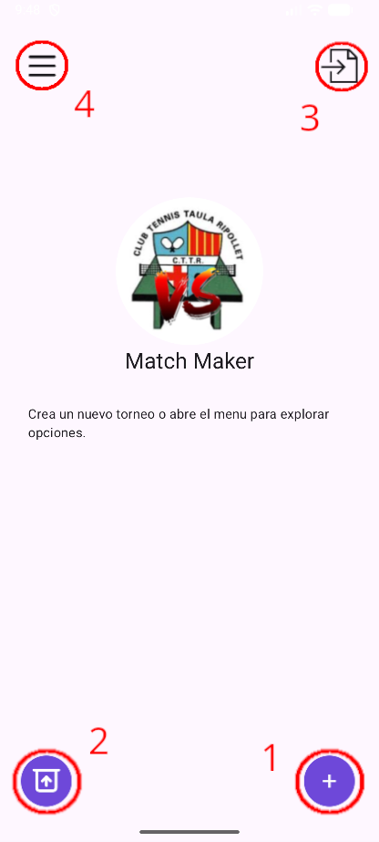
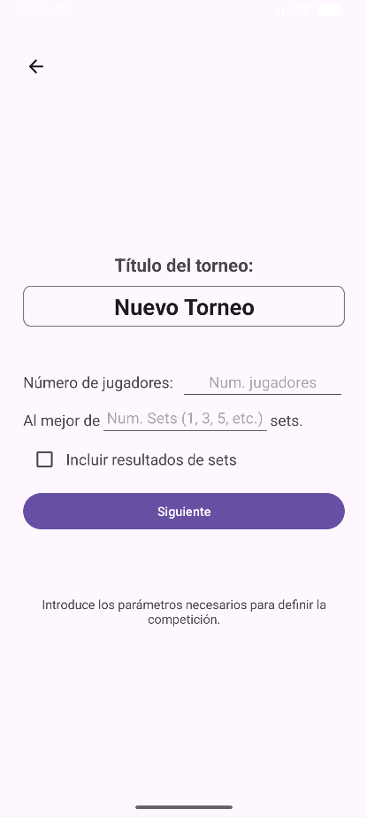
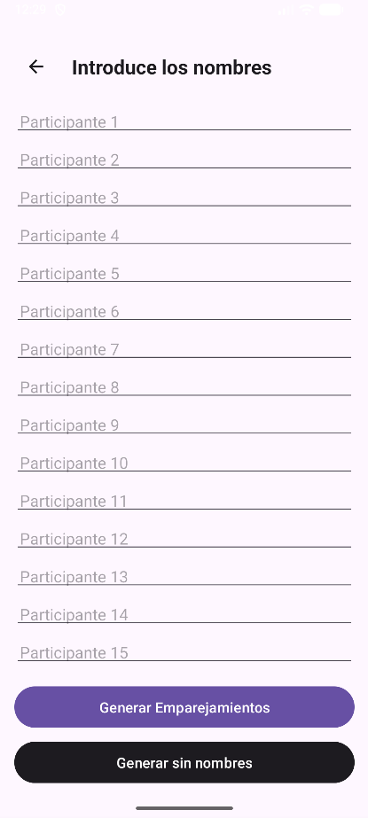
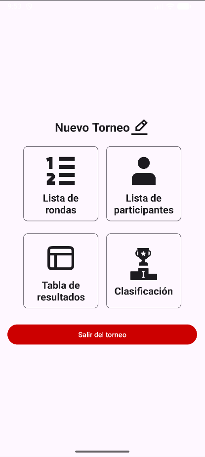
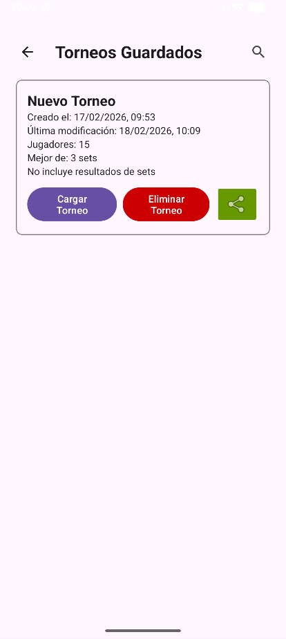

# Match Maker
Match Maker is an app that helps you create and manage Round Robin tournaments for Table Tennis competitions. It allows you to easily set up matches, track scores, and determine winners based on the results.

## Table of Contents
- [Features](#features)
- [Installation](#installation)
- [Usage](#usage)
- [More Information](#more-information)

## Features
- Create and manage Round Robin tournaments
- Add players and set up matches
- Track scores and determine winners
- User-friendly interface for easy navigation
- Import/Export Tournament data for backup and sharing

## Installation
1. Go to the [Releases](https://github.com/Strifere/MatchMaker/releases/tag/v1.0.0) page and download the latest version of Match Maker.
2. Allow installation from unknown sources if prompted.
3. Follow the on-screen instructions to complete the installation process.

## Usage
After installing the app and opening it, you will see the main screen where you can manage your tournaments.

1. Create a new tournament button: This button allows you to start a new tournament by entering the necessary details such as tournament name, players, and match settings. More info on how to create a tournament can be found in the [Create Tournament Guide](#creating-a-tournament).
2. Saved tournaments list: This section displays a list of your saved tournaments. You can click on any tournament to view its details, edit it, export it, or delete it.
3. Import tournament button: This button allows you to import a previously exported tournament file. This is useful for restoring a tournament from a backup or sharing it with others. The file must be a JSON file that was exported from Match Maker.
4. Open menu button: This button opens the main menu where you can access additional features such as settings, help, and about information.

### Creating a Tournament
To create a new tournament, click on the **Create Tournament** button and you will navigate to the next screen where you can enter the tournament details.

Just enter the information required to continue with the process of creating your tournament. You can add players, set up match settings, and customize the tournament according to your preferences. Once you have entered all the necessary information, click on the **Siguiente** button to go to the next screen.

On this screen you can enter the names of the players participating in the tournament. The list will contain as many input fields as the number of players you specified in the previous screen. Once you have entered all the player names, click on the **Generar Emparejamientos** button to finalize the creation of your tournament.

In case you don't want to enter the names of the players, you can leave the input fields empty and click the **Generar sin nombres** button and the app will automatically assign default names to the players (1, 2, etc.).

> Note: If you want to edit the players names after creating the torunament, you can do it in the **Players Screen** on the [Torunament Screen](#managing-a-tournament).

### Managing a Tournament

Once you have created, loaded or imported a tournament, you will be able to manage it in the Tournament Screen.

The *pencil* icon next to the tournament name will let you change it.

+ **Lista de Rondas**: This button will let you navigate to the screen where the list of all rounds in the tournament are shown. Inside each round, the matches that have to be played can be inputed.
+ **Lista de participantes**: This button will let you navigate to the screen that contains a list of all the players in the tournament and their stats.
+ **Tabla de resultados**: This button will let you navigate to the screen that contains the table where the results of each match are shown.
+ **Clasificación**: This button will let you navigate to the classification table screen where you can check the general classification of the tournament.

If you click **Salir del torneo** then the tournament will be saved and you coan load it again whenever you want in the [Load Tournament Screen](#loading-a-tournament).

### Loading a Tournament

In this screen, a list of all the tournaments that are registered in your device database of the app will be shown.

+ **Cargar Torneo**: This button will let you load the tournament and will navigate directly to the [Tournament Screen](#managing-a-tournament).
+ **Eliminar Torneo**: This button will erase that tournament data from the database of the app.
+ **Share/Export Button**: The button with a *share* icon will let you export the tournament data to your storage. The tournament data will be serialized as a JSON file that you can later import to the app again if the formatting of the file is correct.

## More Information
This app was built to make organizing Table Tennis tournaments in a Round Robin format easier. The main motivation was to make a solution that isn't perfect but solves you an unexpected situation. If you have any suggestions or feedback, feel free to reach out!

Right now, this software is meant for [Club Tennis Taula Ripollet](https://www.ripollet.cat/serveis/esports/guia-de-loferta-esportiva-a-ripollet/entitats-esportives-sense-anim-de-lucre/club-tennis-taula-ripollet-1) only users, but if there is enough interest, I might consider making it available to a wider audience and reworking the app architecture to add more features and have a better structure.